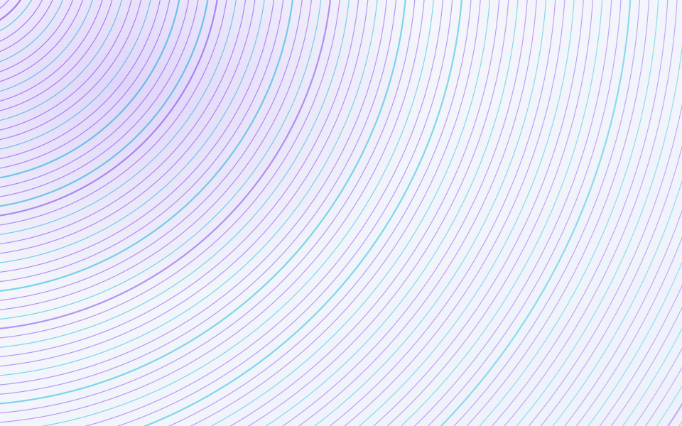
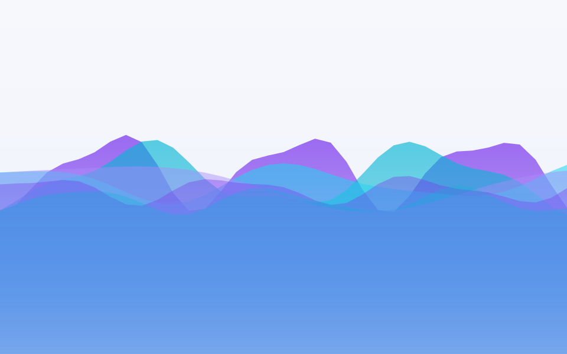
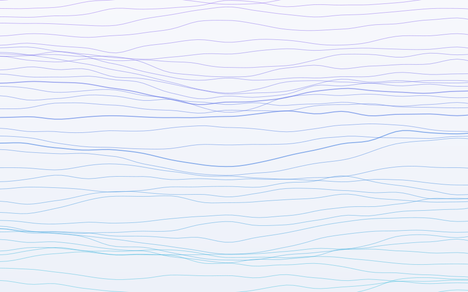
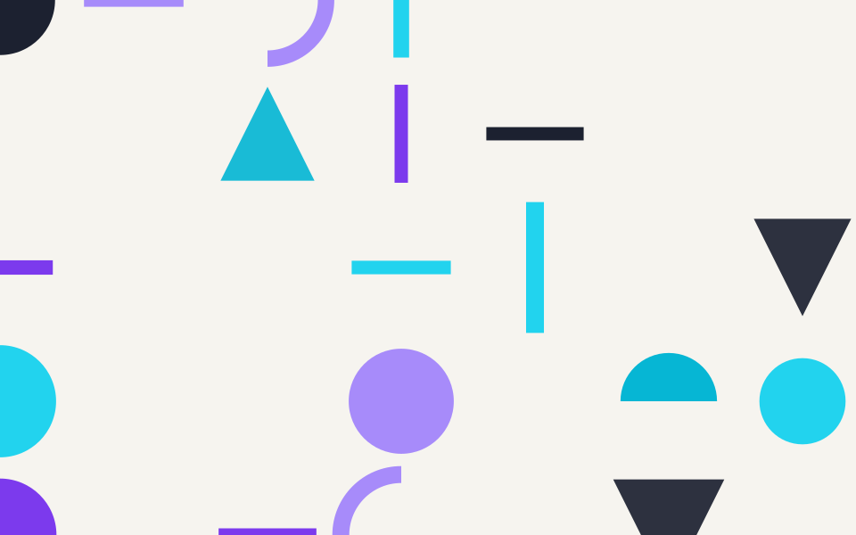
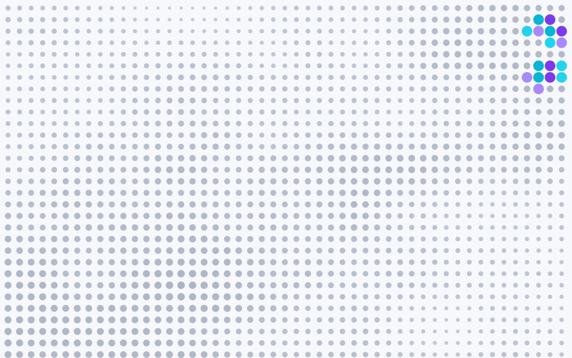

# iskill-geometric-bg

**种子随机的几何背景图生成器** —— 一行命令产出「高级感」底图：hero 背景、OG 分享图、
PPT 底图、卡片底纹。输出轻量 SVG（单文件 20–80 KB，任意缩放不糊）。

零三方依赖（Node 18+ 标准库）。核心是 mulberry32 种子随机 + value noise / fbm，
**同 `--seed` 同图**，构图、配色、深浅全部可复现。

## 快速开始

```bash
# 随机来一张 1600x900
node scripts/gen-bg.mjs

# 指定风格 + 调色板 + 深色
node scripts/gen-bg.mjs --style topo --seed 42 --palette ocean --dark

# OG 分享图尺寸
node scripts/gen-bg.mjs --style mesh --palette sunset --size 1200x630 --out og.svg

# 批量 6 张变体挑着用
node scripts/gen-bg.mjs --count 6 --out ./bg
```

## 六种风格

| 风格 | 观感 | 适合 |
| --- | --- | --- |
| `mesh` | 多层柔光色斑 + 颗粒噪点（Stripe / Linear 风） | hero 背景、OG 图 |
| `rings` | 同心细环 guilloché 质感 | 卡片底纹、证书 |
| `waves` | 层叠波浪山峦、自底向上渐隐 | banner、页脚装饰 |
| `topo` | fbm 噪声等高线山脊 | 科技感背景、封面 |
| `bauhaus` | 包豪斯平面构成（圆 / 弧 / 三角 / 色条） | 海报、插画感页面 |
| `dots` | 噪声调制的半调点阵 + 主色锚点 | 极简背景、侧边栏 |

样例见 [`examples/`](examples/)（seed=42、aurora 调色板为主）：

| mesh | rings | waves |
| --- | --- | --- |
|  |  |  |

| topo | bauhaus | dots |
| --- | --- | --- |
|  |  |  |

深色 + 其他调色板示例：[`geo-topo-ocean-dark.svg`](examples/geo-topo-ocean-dark.svg)、
[`geo-waves-sunset-hero.svg`](examples/geo-waves-sunset-hero.svg)（1920x1080 hero 尺寸）。

## 全部选项

| 选项 | 说明 |
| --- | --- |
| `--style <名\|random>` | `mesh` `rings` `waves` `topo` `bauhaus` `dots`（默认 random） |
| `--seed <n>` | 随机种子，同种子同图（默认随机） |
| `--size WxH` | 画布尺寸（默认 `1600x900`） |
| `--palette <预设\|#hex,...>` | 预设：`aurora` `sunset` `ocean` `forest` `candy` `ember` `berry` `mono`；或逗号分隔 hex（≥ 2 个） |
| `--dark` / `--light` | 深色 / 浅色底（默认随机偏浅） |
| `--count <n>` | 批量出 n 张（种子步进，风格 / 构图各异） |
| `--out <目录\|文件.svg>` | 输出目标（默认 `./geometric-bg/`） |

## 实用技巧

- **背景要「存在但不抢戏」**：优先 `topo` / `rings` 浅色 + `mono` 或同色系深浅调色板。
- **挑图**：`--count 12` 一次出 12 张，选中哪张记下文件名里的 seed 回头精修。
- **要 PNG**：SVG 是纯文本产物；转 PNG 用浏览器打开截图、`agent-browser screenshot`，
  或任意转换工具（`rsvg-convert` 等）。
- **加新风格**：在 `scripts/lib/styles/` 照抄一个文件（统一签名
  `render(ctx) → { defs, body }`，ctx 提供 `w,h,rng,colors,dark,uid,fbm,mixHex,f2`），
  在 `gen-bg.mjs` 注册即可。

## 作为 AI skill 使用

让 agent 安装：**「请帮我安装 Skill：aispin/iskill-geometric-bg，并告诉我它的用法」**。
触发词：几何背景、背景图、底纹、纹理背景、hero 背景、mesh gradient、bauhaus。
技能细节见 [`SKILL.md`](SKILL.md)。

## 来源

同心环底纹思路源自 [iskill-generate-sponsors](https://github.com/aispin/iskill-generate-sponsors)
外链卡的 CSS 生成式底纹，本技能将其泛化为独立的多风格 SVG 生成器。
